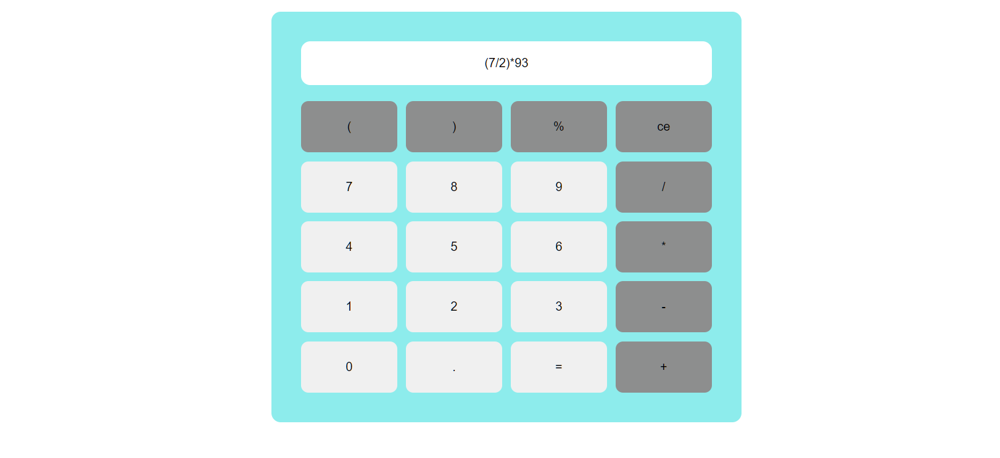

# About

## calculator
A simple calculator built using HTML/CSS & Javascript. This project was created as an assignment while learning Javascript.

## 🔗Demo Link
https://samhith32.netlify.app/
 

- Built using HTML, CSS, and Javascript
- Allows for both mouse and keyboard input
- Compatible with any device and fully responsive
- Advanced Javascript concepts were utilized in the creation of this project
- Completed in under 4 hours

As you can see, the calculator is compatible with any device and is fully responsive. Feel free to give me your suggestions and feedback on what to improve.

#javascript #webdevelopment #learningeveryday #learncodeonline
 

# screenshot

compitable with any devices.

